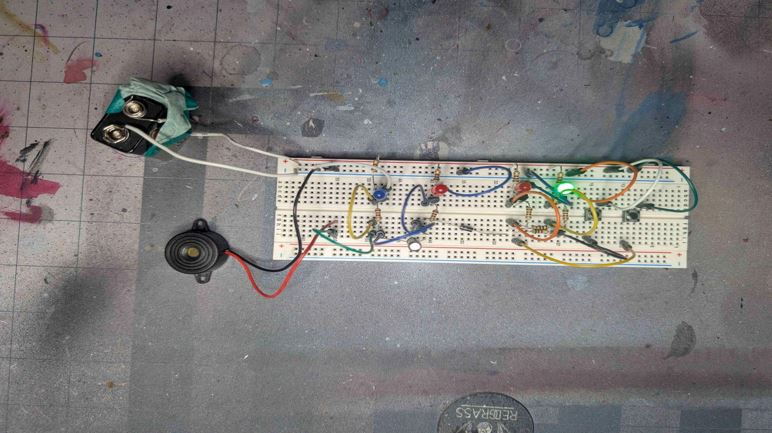
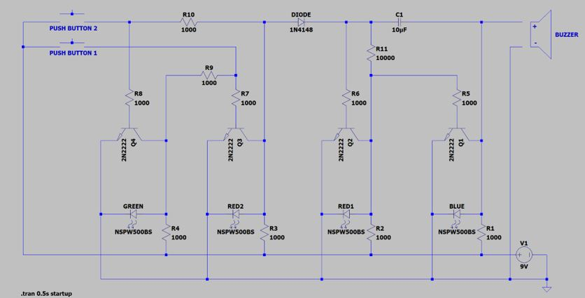

# transistor-logic-visual-auditory-alarm
Visual and Auditory Alarm System (Analog Implementation)

This project is a hardware-based alarm system designed as a final project for EECS 2210. It utilizes the fundamental properties of NPN transistors and RC (Resistor-Capacitor) circuits to create a multi-state alarm without the use of a microcontroller.
🛠 Features

    Dual-Unit Architecture: Features a dedicated Control Unit (triggering) and a Function Unit (execution).

    Transistor-Based Switching: Utilizes NPN transistors as electronic switches to short-circuit LEDs, effectively controlling their ON/OFF states based on base-pin current.

    Astable Multivibrator Logic: Employs a 10uF capacitor to create a delay loop, resulting in a periodic beeping buzzer and alternating "flicker" effect for the Red and Blue LEDs.

    Manual Interaction: Includes dual-button input to toggle between system states (Active/Standby).

📐 Circuit Theory & Components

    Transistors (Q1-Q4): Functioning in the saturation and cutoff regions to act as digital switches.

    Capacitive Delay: The timing of the alarm's pulse is determined by the RC constant. Increasing the capacitance decreases the frequency of the beeps and flashes.

    Diodes: Implemented as "one-way doors" to prevent reverse current flow and protect the integrity of the control unit logic.

    LED Status Indicators: * RED2: Standby/Ready state.

        GREEN: System Armed.

        RED1/BLUE: Active Alarm (Flickering).

📋 Component List

    4x NPN Transistors

    1x 10uF Capacitor

    11x Resistors (1kΩ and 10kΩ)

    4x LEDs (Red, Green, Blue)

    1x Piezo Buzzer

    2x Push-buttons

🚀 Learning Outcomes

    Discrete Logic Design: Building a state-based system using only basic electronic components.

    Timing Analysis: Calculating and observing the effects of capacitor charge/discharge cycles on frequency.

    Signal Routing: Using diodes to isolate different sections of a parallel circuit.
